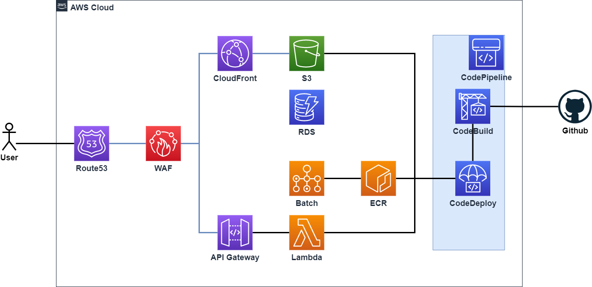

# CFn
This repository is created to store my serverless application configuration file.

## Image


***

## Usage
* AWS Console
1. Create Host Zone in Route53
2. Create Certificate for API Gateway(System own region) and Cloudfront(eu-west-1).
3. Launch Serverless Network with creating stack from "serverless-base.yml".

* Your CLI Console
    * Please set up AWS CLI v2 before following procedure.
4. Clone this repository.
```bash
git clone https://github.com/Takudon/Serverless_HelloWorld.git
```
5. On "sam-app" directory, execute "sam build" and "sam deploy"
```bash
sam build
sam deploy --guided --stack-name STACK_NAME --region REGION(ex:ap-north-east-1) --profile YOUR_AWS_PROFILE_NAME
```

## Usage (CloudFormation and SAM parameters)
Update now...

***

## Update
0.1     Initialize network configuration and web distribution.
0.2     Add sam-app (sample SAM application).
0.3     Update Lambda to be in-VPC resource and connectivity between SAM and serverless-base 

***

## Will be updated
0.4     Attach Custom Domain Name and add security configuration on API gateway.
0.5     Add sample DynamoDB table and Connection between Lambda and DynamoDB.
0.6     Add WAF v2 WebACL attatched on CloudFront and API Gateway
0.7     Add AWS Batch for executing large-scale proccessing(ex: Daily/Monthly batch proccess)
0.8     Add sample CI/CD Pipeline.(may be crated by AWS CodeStar)
